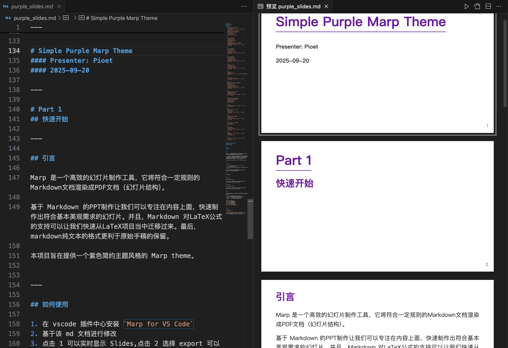

# simple_purple_marp_theme

Marp is an efficient slideshow creation tool that renders Markdown documents complying with specific rules into PDF documents (in a slideshow structure).

PPT creation based on Markdown allows us to focus on the content and quickly produce slides that meet basic aesthetic requirements. Additionally, Markdown's support for LaTeX formulas enables us to quickly migrate from LaTeX projects. Finally, the plain text format of Markdown is more conducive to preserving the original manuscript.

This project aims to provide a Marp theme with a simple and minimalist purple style.

For more details, please refer to the md and pdf documents of this project. 

Thanks to [chenyang1999/Marp_theme_for_THUslides: 使用 Marp 制作清华大学组会 Slides模板](https://github.com/chenyang1999/Marp_theme_for_THUslides)